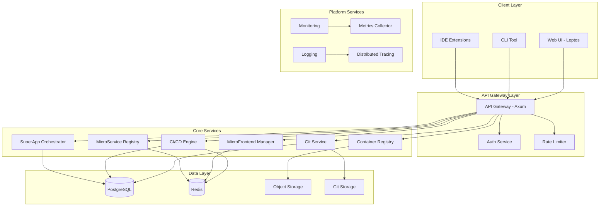

# Design Document - Codeza Platform

## Overview

Codeza adalah platform pengembangan modern yang dibangun dengan Rust, menggunakan Leptos untuk frontend dan Axum untuk backend. Platform ini dirancang untuk mendukung pengembangan SuperApps dengan arsitektur MicroFrontend dan MicroServices yang scalable, secure, dan performant.

### Design Principles

1. **Rust-First Architecture**: Memanfaatkan keunggulan Rust dalam memory safety, concurrency, dan performance
2. **Cloud-Native**: Dirancang untuk deployment di Kubernetes dengan container-first approach
3. **API-First**: Semua functionality exposed melalui well-defined APIs
4. **Modular & Extensible**: Plugin architecture untuk custom extensions
5. **Developer Experience**: Prioritas pada tooling dan workflow yang intuitive
6. **Security by Default**: Built-in security controls di setiap layer

## Architecture

### High-Level Architecture



### Technology Stack

#### Frontend
- **Framework**: Leptos (Rust-based reactive framework)
- **Styling**: TailwindCSS
- **State Management**: Leptos signals and contexts
- **Build Tool**: Trunk
- **WebAssembly**: For compute-intensive client operations

#### Backend
- **Web Framework**: Axum (async Rust web framework)
- **Database**: PostgreSQL 16+ (primary data store)
- **Cache**: Redis 7+ (caching, pub/sub, queues)
- **Object Storage**: S3-compatible (MinIO for self-hosted)
- **Message Queue**: Redis Streams / NATS
- **Search**: Meilisearch (full-text search)

#### Infrastructure
- **Container Runtime**: Docker / containerd
- **Orchestration**: Kubernetes
- **Service Mesh**: Linkerd (lightweight, Rust-based)
- **Ingress**: Traefik / Nginx
- **Monitoring**: Prometheus + Grafana
- **Tracing**: Jaeger / Tempo
- **Logging**: Loki

## Components and Interfaces

### 1. Authentication Service

**Responsibility**: User authentication, authorization, dan session management

**Technology**:
- JWT tokens dengan RS256 signing
- OAuth2 provider integration
- RBAC dengan Casbin policy engine

**API Endpoints**:
```rust
// Authentication
POST   /api/v1/auth/login
POST   /api/v1/auth/logout
POST   /api/v1/auth/refresh
GET    /api/v1/auth/user

// OAuth2
GET    /api/v1/auth/oauth/{provider}
GET    /api/v1/auth/oauth/{provider}/callback

// Authorization
POST   /api/v1/auth/check-permission
GET    /api/v1/auth/user/permissions
```

**Data Models**:
```rust
struct User {
    id: Uuid,
    username: String,
    email: String,
    password_hash: String,
    created_at: DateTime<Utc>,
    updated_at: DateTime<Utc>,
}

struct Session {
    id: Uuid,
    user_id: Uuid,
    token: String,
    expires_at: DateTime<Utc>,
}

struct Permission {
    id: Uuid,
    resource: String,
    action: String,
    role: Role,
}

enum Role {
    Owner,
    Maintainer,
    Developer,
    Reporter,
    Guest,
}
```

### 2. Git Service

**Responsibility**: Git repository management, code browsing, merge requests

**Technology**:
- libgit2 bindings untuk Git operations
- Git HTTP/SSH protocol implementation
- Syntax highlighting dengan tree-sitter

**API Endpoints**:
```rust
// Repository Management
POST   /api/v1/repos
GET    /api/v1/repos/{owner}/{repo}
DELETE /api/v1/repos/{owner}/{repo}
PATCH  /api/v1/repos/{owner}/{repo}

// Git Operations
GET    /api/v1/repos/{owner}/{repo}/tree/{ref}
GET    /api/v1/repos/{owner}/{repo}/blob/{ref}/{path}
GET    /api/v1/repos/{owner}/{repo}/commits
GET    /api/v1/repos/{owner}/{repo}/branches

// Merge Requests
POST   /api/v1/repos/{owner}/{repo}/merge-requests
GET    /api/v1/repos/{owner}/{repo}/merge-requests/{id}
POST   /api/v1/repos/{owner}/{repo}/merge-requests/{id}/merge
```

**Data Models**:
```rust
struct Repository {
    id: Uuid,
    owner_id: Uuid,
    name: String,
    description: Option<String>,
    default_branch: String,
    is_private: bool,
    storage_path: String,
    created_at: DateTime<Utc>,
}

struct MergeRequest {
    id: Uuid,
    repository_id: Uuid,
    author_id: Uuid,
    title: String,
    description: String,
    source_branch: String,
    target_branch: String,
    status: MRStatus,
    created_at: DateTime<Utc>,
}

enum MRStatus {
    Open,
    Merged,
    Closed,
    Draft,
}
```

### 3. CI/CD Engine

**Responsibility**: Pipeline execution, job scheduling, artifact management

**Technology**:
- Tokio untuk async job execution
- Container runtime integration (Docker API)
- YAML parser untuk pipeline configuration

**API Endpoints**:
```rust
// Pipeline Management
POST   /api/v1/repos/{owner}/{repo}/pipelines
GET    /api/v1/repos/{owner}/{repo}/pipelines/{id}
POST   /api/v1/repos/{owner}/{repo}/pipelines/{id}/cancel
GET    /api/v1/repos/{owner}/{repo}/pipelines/{id}/logs

// Jobs
GET    /api/v1/repos/{owner}/{repo}/jobs/{id}
POST   /api/v1/repos/{owner}/{repo}/jobs/{id}/retry
GET    /api/v1/repos/{owner}/{repo}/jobs/{id}/artifacts

// Runners
POST   /api/v1/runners/register
POST   /api/v1/runners/{id}/jobs/request
POST   /api/v1/runners/{id}/jobs/{job_id}/update
```

**Pipeline Configuration Format**:
```yaml
# .codeza-ci.yml
stages:
  - build
  - test
  - deploy

variables:
  RUST_VERSION: "1.75"

build:
  stage: build
  image: rust:${RUST_VERSION}
  script:
    - cargo build --release
  artifacts:
    paths:
      - target/release/app

test:
  stage: test
  image: rust:${RUST_VERSION}
  script:
    - cargo test
  coverage: '/\d+\.\d+% coverage/'

deploy:
  stage: deploy
  script:
    - kubectl apply -f k8s/
  only:
    - main
```

**Data Models**:
```rust
struct Pipeline {
    id: Uuid,
    repository_id: Uuid,
    commit_sha: String,
    ref_name: String,
    status: PipelineStatus,
    started_at: Option<DateTime<Utc>>,
    finished_at: Option<DateTime<Utc>>,
}

struct Job {
    id: Uuid,
    pipeline_id: Uuid,
    name: String,
    stage: String,
    status: JobStatus,
    runner_id: Option<Uuid>,
    script: Vec<String>,
    artifacts: Vec<Artifact>,
}

enum PipelineStatus {
    Pending,
    Running,
    Success,
    Failed,
    Canceled,
}
```

### 4. MicroFrontend Manager

**Responsibility**: MicroFrontend deployment, routing, version management

**Technology**:
- Module Federation dengan Webpack/Vite
- WebAssembly runtime untuk Leptos apps
- CDN integration untuk asset serving

**API Endpoints**:
```rust
// MicroFrontend Management
POST   /api/v1/microfrontends
GET    /api/v1/microfrontends/{id}
POST   /api/v1/microfrontends/{id}/deploy
GET    /api/v1/microfrontends/{id}/versions

// Routing
GET    /api/v1/microfrontends/routes
POST   /api/v1/microfrontends/routes
PATCH  /api/v1/microfrontends/routes/{id}

// A/B Testing
POST   /api/v1/microfrontends/{id}/experiments
GET    /api/v1/microfrontends/{id}/experiments/{exp_id}
```

**Data Models**:
```rust
struct MicroFrontend {
    id: Uuid,
    name: String,
    repository_id: Uuid,
    entry_point: String,
    framework: FrontendFramework,
    created_at: DateTime<Utc>,
}

struct MFEVersion {
    id: Uuid,
    microfrontend_id: Uuid,
    version: String,
    bundle_url: String,
    deployed_at: DateTime<Utc>,
}

struct Route {
    id: Uuid,
    path: String,
    microfrontend_id: Uuid,
    version_id: Uuid,
    priority: i32,
}

enum FrontendFramework {
    Leptos,
    React,
    Vue,
    Angular,
    Svelte,
}
```

### 5. MicroService Registry

**Responsibility**: Service discovery, health checking, load balancing

**Technology**:
- Consul-like service registry
- gRPC untuk service-to-service communication
- Health check dengan configurable intervals

**API Endpoints**:
```rust
// Service Registration
POST   /api/v1/services/register
DELETE /api/v1/services/{id}/deregister
PUT    /api/v1/services/{id}/heartbeat

// Service Discovery
GET    /api/v1/services
GET    /api/v1/services/{name}
GET    /api/v1/services/{name}/instances

// Health Checks
GET    /api/v1/services/{id}/health
POST   /api/v1/services/{id}/health-check
```

**Data Models**:
```rust
struct Service {
    id: Uuid,
    name: String,
    version: String,
    instances: Vec<ServiceInstance>,
    health_check: HealthCheck,
}

struct ServiceInstance {
    id: Uuid,
    service_id: Uuid,
    host: String,
    port: u16,
    status: InstanceStatus,
    metadata: HashMap<String, String>,
    last_heartbeat: DateTime<Utc>,
}

struct HealthCheck {
    endpoint: String,
    interval: Duration,
    timeout: Duration,
    healthy_threshold: u32,
    unhealthy_threshold: u32,
}

enum InstanceStatus {
    Healthy,
    Unhealthy,
    Starting,
    Stopping,
}
```

### 6. SuperApp Orchestrator

**Responsibility**: Orchestrate deployment dari multiple services dan frontends

**Technology**:
- Kubernetes operator pattern
- Helm charts untuk packaging
- GitOps dengan Flux/ArgoCD integration

**API Endpoints**:
```rust
// SuperApp Management
POST   /api/v1/superapps
GET    /api/v1/superapps/{id}
PATCH  /api/v1/superapps/{id}
DELETE /api/v1/superapps/{id}

// Deployment
POST   /api/v1/superapps/{id}/deploy
GET    /api/v1/superapps/{id}/deployments
POST   /api/v1/superapps/{id}/rollback

// Configuration
GET    /api/v1/superapps/{id}/config
PATCH  /api/v1/superapps/{id}/config
```

**Data Models**:
```rust
struct SuperApp {
    id: Uuid,
    name: String,
    description: String,
    services: Vec<ServiceRef>,
    frontends: Vec<FrontendRef>,
    config: SuperAppConfig,
}

struct Deployment {
    id: Uuid,
    superapp_id: Uuid,
    version: String,
    strategy: DeploymentStrategy,
    status: DeploymentStatus,
    started_at: DateTime<Utc>,
    completed_at: Option<DateTime<Utc>>,
}

enum DeploymentStrategy {
    RollingUpdate,
    BlueGreen,
    Canary { percentage: u8 },
}

struct SuperAppConfig {
    api_gateway: GatewayConfig,
    service_mesh: ServiceMeshConfig,
    monitoring: MonitoringConfig,
}
```

### 7. Container Registry

**Responsibility**: OCI image storage, vulnerability scanning, image signing

**Technology**:
- OCI Distribution Spec implementation
- Trivy untuk vulnerability scanning
- Sigstore/Cosign untuk image signing

**API Endpoints**:
```rust
// Registry Operations (OCI Distribution Spec)
GET    /v2/
GET    /v2/{name}/tags/list
GET    /v2/{name}/manifests/{reference}
PUT    /v2/{name}/manifests/{reference}
GET    /v2/{name}/blobs/{digest}
POST   /v2/{name}/blobs/uploads/

// Vulnerability Scanning
POST   /api/v1/registry/{name}/scan
GET    /api/v1/registry/{name}/vulnerabilities

// Image Signing
POST   /api/v1/registry/{name}/sign
GET    /api/v1/registry/{name}/signatures
```

**Data Models**:
```rust
struct Image {
    id: Uuid,
    repository: String,
    tag: String,
    digest: String,
    manifest: String,
    size: i64,
    pushed_at: DateTime<Utc>,
}

struct Vulnerability {
    id: String,
    severity: Severity,
    package: String,
    version: String,
    fixed_version: Option<String>,
    description: String,
}

enum Severity {
    Critical,
    High,
    Medium,
    Low,
    Unknown,
}
```

### 8. API Gateway

**Responsibility**: Request routing, authentication, rate limiting, transformation

**Technology**:
- Axum dengan custom middleware
- Tower untuk service composition
- Redis untuk rate limiting state

**Features**:
- Path-based routing
- JWT validation
- Rate limiting (token bucket algorithm)
- Request/response transformation
- CORS handling
- API versioning
- Circuit breaker pattern

**Configuration**:
```rust
struct GatewayConfig {
    routes: Vec<Route>,
    rate_limits: Vec<RateLimit>,
    cors: CorsConfig,
    timeout: Duration,
}

struct Route {
    path: String,
    method: HttpMethod,
    upstream: String,
    auth_required: bool,
    rate_limit: Option<String>,
}

struct RateLimit {
    name: String,
    requests: u32,
    window: Duration,
    scope: RateLimitScope,
}

enum RateLimitScope {
    Global,
    PerUser,
    PerIP,
    PerApiKey,
}
```

### 9. Monitoring Dashboard

**Responsibility**: Metrics collection, alerting, log aggregation, tracing

**Technology**:
- Prometheus untuk metrics
- Loki untuk logs
- Jaeger untuk distributed tracing
- Grafana untuk visualization

**Metrics Collected**:
- Request rate, latency, error rate (RED metrics)
- CPU, memory, disk usage (USE metrics)
- Custom business metrics
- Pipeline execution metrics
- Git operation metrics

**Data Models**:
```rust
struct Metric {
    name: String,
    labels: HashMap<String, String>,
    value: f64,
    timestamp: DateTime<Utc>,
}

struct Alert {
    id: Uuid,
    name: String,
    condition: AlertCondition,
    severity: AlertSeverity,
    channels: Vec<NotificationChannel>,
}

struct Trace {
    trace_id: String,
    spans: Vec<Span>,
    duration: Duration,
}

struct Span {
    span_id: String,
    parent_id: Option<String>,
    operation: String,
    start_time: DateTime<Utc>,
    duration: Duration,
    tags: HashMap<String, String>,
}
```

## Data Models

### Core Entities

```rust
// User and Organization
struct User {
    id: Uuid,
    username: String,
    email: String,
    full_name: Option<String>,
    avatar_url: Option<String>,
    created_at: DateTime<Utc>,
}

struct Organization {
    id: Uuid,
    name: String,
    display_name: String,
    description: Option<String>,
    created_at: DateTime<Utc>,
}

struct OrganizationMember {
    organization_id: Uuid,
    user_id: Uuid,
    role: Role,
    joined_at: DateTime<Utc>,
}

// Repository
struct Repository {
    id: Uuid,
    owner_id: Uuid,
    owner_type: OwnerType,
    name: String,
    description: Option<String>,
    default_branch: String,
    is_private: bool,
    is_archived: bool,
    storage_path: String,
    size: i64,
    stars_count: i32,
    forks_count: i32,
    created_at: DateTime<Utc>,
    updated_at: DateTime<Utc>,
}

enum OwnerType {
    User,
    Organization,
}

// Issue and Merge Request
struct Issue {
    id: Uuid,
    repository_id: Uuid,
    author_id: Uuid,
    title: String,
    description: String,
    status: IssueStatus,
    labels: Vec<String>,
    assignees: Vec<Uuid>,
    created_at: DateTime<Utc>,
    closed_at: Option<DateTime<Utc>>,
}

struct Comment {
    id: Uuid,
    issue_id: Option<Uuid>,
    merge_request_id: Option<Uuid>,
    author_id: Uuid,
    content: String,
    created_at: DateTime<Utc>,
    updated_at: DateTime<Utc>,
}
```

### Database Schema

```sql
-- Users and Authentication
CREATE TABLE users (
    id UUID PRIMARY KEY,
    username VARCHAR(255) UNIQUE NOT NULL,
    email VARCHAR(255) UNIQUE NOT NULL,
    password_hash VARCHAR(255) NOT NULL,
    full_name VARCHAR(255),
    avatar_url TEXT,
    created_at TIMESTAMPTZ NOT NULL DEFAULT NOW(),
    updated_at TIMESTAMPTZ NOT NULL DEFAULT NOW()
);

CREATE TABLE sessions (
    id UUID PRIMARY KEY,
    user_id UUID NOT NULL REFERENCES users(id) ON DELETE CASCADE,
    token VARCHAR(512) UNIQUE NOT NULL,
    expires_at TIMESTAMPTZ NOT NULL,
    created_at TIMESTAMPTZ NOT NULL DEFAULT NOW()
);

-- Organizations
CREATE TABLE organizations (
    id UUID PRIMARY KEY,
    name VARCHAR(255) UNIQUE NOT NULL,
    display_name VARCHAR(255) NOT NULL,
    description TEXT,
    created_at TIMESTAMPTZ NOT NULL DEFAULT NOW()
);

CREATE TABLE organization_members (
    organization_id UUID NOT NULL REFERENCES organizations(id) ON DELETE CASCADE,
    user_id UUID NOT NULL REFERENCES users(id) ON DELETE CASCADE,
    role VARCHAR(50) NOT NULL,
    joined_at TIMESTAMPTZ NOT NULL DEFAULT NOW(),
    PRIMARY KEY (organization_id, user_id)
);

-- Repositories
CREATE TABLE repositories (
    id UUID PRIMARY KEY,
    owner_id UUID NOT NULL,
    owner_type VARCHAR(50) NOT NULL,
    name VARCHAR(255) NOT NULL,
    description TEXT,
    default_branch VARCHAR(255) NOT NULL DEFAULT 'main',
    is_private BOOLEAN NOT NULL DEFAULT false,
    is_archived BOOLEAN NOT NULL DEFAULT false,
    storage_path TEXT NOT NULL,
    size BIGINT NOT NULL DEFAULT 0,
    stars_count INTEGER NOT NULL DEFAULT 0,
    forks_count INTEGER NOT NULL DEFAULT 0,
    created_at TIMESTAMPTZ NOT NULL DEFAULT NOW(),
    updated_at TIMESTAMPTZ NOT NULL DEFAULT NOW(),
    UNIQUE (owner_id, name)
);

CREATE INDEX idx_repositories_owner ON repositories(owner_id, owner_type);

-- Pipelines and Jobs
CREATE TABLE pipelines (
    id UUID PRIMARY KEY,
    repository_id UUID NOT NULL REFERENCES repositories(id) ON DELETE CASCADE,
    commit_sha VARCHAR(40) NOT NULL,
    ref_name VARCHAR(255) NOT NULL,
    status VARCHAR(50) NOT NULL,
    started_at TIMESTAMPTZ,
    finished_at TIMESTAMPTZ,
    created_at TIMESTAMPTZ NOT NULL DEFAULT NOW()
);

CREATE TABLE jobs (
    id UUID PRIMARY KEY,
    pipeline_id UUID NOT NULL REFERENCES pipelines(id) ON DELETE CASCADE,
    name VARCHAR(255) NOT NULL,
    stage VARCHAR(255) NOT NULL,
    status VARCHAR(50) NOT NULL,
    runner_id UUID,
    started_at TIMESTAMPTZ,
    finished_at TIMESTAMPTZ,
    created_at TIMESTAMPTZ NOT NULL DEFAULT NOW()
);

CREATE INDEX idx_jobs_pipeline ON jobs(pipeline_id);
CREATE INDEX idx_jobs_status ON jobs(status) WHERE status IN ('pending', 'running');
```

## Error Handling

### Error Types

```rust
#[derive(Debug, thiserror::Error)]
pub enum CodezaError {
    #[error("Authentication failed: {0}")]
    AuthenticationError(String),
    
    #[error("Authorization failed: {0}")]
    AuthorizationError(String),
    
    #[error("Resource not found: {0}")]
    NotFound(String),
    
    #[error("Validation error: {0}")]
    ValidationError(String),
    
    #[error("Database error: {0}")]
    DatabaseError(#[from] sqlx::Error),
    
    #[error("Git operation failed: {0}")]
    GitError(String),
    
    #[error("Pipeline execution failed: {0}")]
    PipelineError(String),
    
    #[error("Internal server error: {0}")]
    InternalError(String),
}

impl IntoResponse for CodezaError {
    fn into_response(self) -> Response {
        let (status, message) = match self {
            CodezaError::AuthenticationError(msg) => (StatusCode::UNAUTHORIZED, msg),
            CodezaError::AuthorizationError(msg) => (StatusCode::FORBIDDEN, msg),
            CodezaError::NotFound(msg) => (StatusCode::NOT_FOUND, msg),
            CodezaError::ValidationError(msg) => (StatusCode::BAD_REQUEST, msg),
            CodezaError::DatabaseError(_) => (
                StatusCode::INTERNAL_SERVER_ERROR,
                "Database error occurred".to_string(),
            ),
            _ => (
                StatusCode::INTERNAL_SERVER_ERROR,
                "Internal server error".to_string(),
            ),
        };
        
        let body = Json(json!({
            "error": message,
            "status": status.as_u16(),
        }));
        
        (status, body).into_response()
    }
}
```

### Error Response Format

```json
{
  "error": "Resource not found: Repository 'example/repo' does not exist",
  "status": 404,
  "timestamp": "2025-10-29T10:30:00Z",
  "request_id": "req_abc123"
}
```

## Testing Strategy

### Unit Testing
- Test individual functions dan methods
- Mock external dependencies
- Target: 80% code coverage
- Tools: `cargo test`, `mockall`

### Integration Testing
- Test API endpoints end-to-end
- Use test database (PostgreSQL in Docker)
- Test service interactions
- Tools: `reqwest`, `testcontainers`

### Performance Testing
- Load testing dengan k6
- Benchmark critical paths
- Target: <100ms p95 latency untuk API calls
- Tools: `criterion`, `k6`

### Security Testing
- Dependency vulnerability scanning
- SAST dengan `cargo-audit`
- Penetration testing
- Tools: `cargo-audit`, `trivy`, OWASP ZAP

### E2E Testing
- Browser automation untuk UI flows
- Test complete user journeys
- Tools: Playwright, Selenium

## Deployment Architecture

### Kubernetes Deployment

```yaml
# Deployment structure
codeza-platform/
├── api-gateway/
│   ├── deployment.yaml
│   ├── service.yaml
│   └── hpa.yaml
├── git-service/
│   ├── deployment.yaml
│   ├── service.yaml
│   └── pvc.yaml
├── cicd-engine/
│   ├── deployment.yaml
│   ├── service.yaml
│   └── configmap.yaml
├── registry/
│   ├── deployment.yaml
│   ├── service.yaml
│   └── pvc.yaml
└── database/
    ├── statefulset.yaml
    ├── service.yaml
    └── pvc.yaml
```

### Scaling Strategy

- **Horizontal Pod Autoscaling**: Based on CPU/memory metrics
- **Vertical Pod Autoscaling**: For stateful services
- **Cluster Autoscaling**: Add nodes when needed
- **Database Sharding**: For large installations

### High Availability

- **Multi-zone deployment**: Spread across availability zones
- **Database replication**: PostgreSQL streaming replication
- **Redis Sentinel**: For cache high availability
- **Load balancing**: Multiple replicas behind load balancer

## Security Considerations

### Authentication & Authorization
- JWT tokens dengan short expiration
- Refresh token rotation
- RBAC dengan principle of least privilege
- MFA support untuk sensitive operations

### Data Protection
- Encryption at rest (AES-256)
- Encryption in transit (TLS 1.3)
- Secrets management dengan Vault integration
- PII data masking dalam logs

### Network Security
- Network policies dalam Kubernetes
- Service mesh untuk mTLS
- API rate limiting
- DDoS protection

### Compliance
- Audit logging untuk all operations
- GDPR compliance (data export, deletion)
- SOC2 controls implementation
- Regular security audits

## Performance Optimization

### Caching Strategy
- **L1 Cache**: In-memory cache dalam service (LRU)
- **L2 Cache**: Redis untuk shared cache
- **CDN**: CloudFlare untuk static assets
- **Database query cache**: PostgreSQL query result cache

### Database Optimization
- Proper indexing strategy
- Connection pooling (sqlx)
- Read replicas untuk read-heavy workloads
- Partitioning untuk large tables

### API Optimization
- GraphQL untuk flexible queries
- Pagination untuk large result sets
- Field selection untuk reduce payload
- Compression (gzip, brotli)

### Frontend Optimization
- Code splitting
- Lazy loading
- WebAssembly untuk compute-intensive tasks
- Service worker untuk offline support

## Monitoring and Observability

### Metrics
- **RED Metrics**: Rate, Errors, Duration
- **USE Metrics**: Utilization, Saturation, Errors
- **Business Metrics**: User signups, pipeline runs, deployments

### Logging
- Structured logging (JSON format)
- Log levels: ERROR, WARN, INFO, DEBUG, TRACE
- Correlation IDs untuk request tracing
- Log aggregation dengan Loki

### Tracing
- Distributed tracing dengan OpenTelemetry
- Trace sampling untuk reduce overhead
- Span attributes untuk context
- Integration dengan Jaeger

### Alerting
- Alert on SLO violations
- On-call rotation dengan PagerDuty
- Alert fatigue prevention
- Runbook links dalam alerts

## Migration Strategy

### From Existing Platforms

**GitLab/GitHub Migration**:
1. Export repositories via API
2. Import dengan preserved history
3. Migrate issues dan merge requests
4. Update CI/CD configurations
5. Update webhooks dan integrations

**Data Migration**:
- Incremental migration untuk minimize downtime
- Validation checks post-migration
- Rollback plan jika issues
- Parallel run period untuk verification

## Future Enhancements

### Phase 2 Features
- AI-powered code review
- Automated security patching
- Cost optimization recommendations
- Multi-region deployment

### Phase 3 Features
- Marketplace untuk plugins
- Advanced analytics dan insights
- Compliance automation
- Edge computing support

## Conclusion

Design ini menyediakan foundation yang solid untuk Codeza Platform dengan fokus pada:
- **Performance**: Rust-based architecture untuk speed
- **Scalability**: Cloud-native design untuk growth
- **Security**: Built-in security controls
- **Developer Experience**: Modern tooling dan workflows
- **Extensibility**: Plugin architecture untuk customization

Platform ini dirancang untuk kompetitif dengan GitLab dan GitHub sambil menawarkan keunggulan unik dalam performance, resource efficiency, dan support untuk modern architectures (MicroFrontend, MicroServices, SuperApps).
